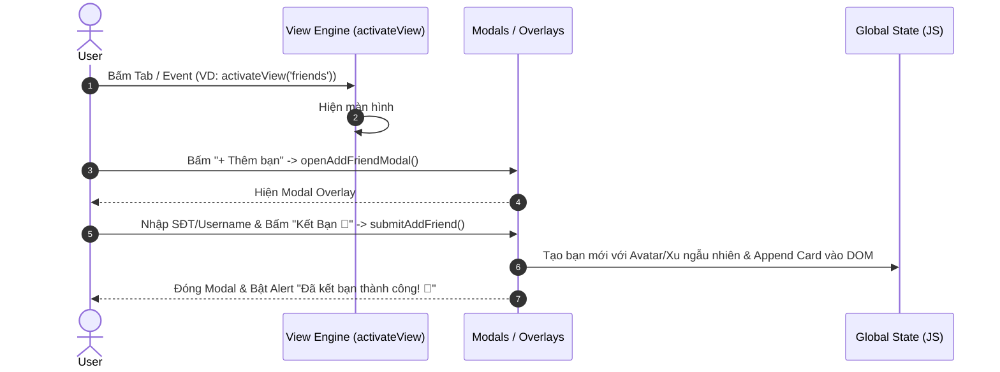

# 🚀 ĐẶC TẢ YÊU CẦU CHỨC NĂNG (FRD) & FULL USE CASES REVERSE ENGINEERING

> **Dự án:** Capy Vocab — Spa Từ Vựng Chill (`capy_vocab.html` / `index.html`)  
> **Chuyên gia thực hiện:** Lead Business Analyst & System Architect  
> **Ghi chú cập nhật:** Đã loại bỏ Module SRS, Bổ sung Use Case Thêm Bạn Bè & Loại bỏ Giới Hạn Quota Quét Ảnh AI (Cho phép Quét Vô Hạn).

---

## 📑 PHẦN 1: TỔNG QUAN HỆ THỐNG & TÁC NHÂN (SYSTEM & ACTORS OVERVIEW)

### 1. Tóm tắt Ứng dụng
- **Tên ứng dụng:** Capy Vocab — Spa Từ Vựng Chill (Capybara Vocab Note).
- **Mục đích cốt lõi:** Ứng dụng học từ vựng tiếng Anh theo phong cách chill, kết hợp công nghệ AI Vision (quét ảnh trích xuất từ vựng **không giới hạn lượt**), đường học Lesson Map cuốn vặn (Winding Path), hệ thống Mini-games tương tác, Đấu trường Solo Arena 1v1 đối kháng trực tiếp, Nuôi Pet ảo đổi trang phục và Mạng xã hội bạn bè kết nối qua Username/SĐT.
- **Đối tượng người dùng:** Học viên cá nhân yêu thích giao diện mầm non/cute 3D (phong cách Duolingo/Yuzu), học sinh - sinh viên, phụ huynh giám sát tiến độ học tập của con.

### 2. Danh sách Tác nhân (Actors)
1. **Guest (Người dùng chưa đăng nhập):** Truy cập màn hình Auth, xem giới thiệu ứng dụng.
2. **Personal User (Học viên Cá nhân):** Người dùng học tự do, làm bài khảo sát Onboarding, quét ảnh từ vựng vô hạn, chơi game, đấu Solo Arena, kết bạn qua Username/SĐT, tích lũy xu Yuzu và mua sắm linh vật.
3. **Parent / Supervisor (Phụ huynh / Giám sát):** Người dùng đăng ký vai trò phụ huynh để theo dõi tiến độ, nhận báo cáo và quản lý lịch học.
4. **System / Capy-sensei AI (Hệ thống & Trợ lý AI):** Tác nhân tự động nhận diện ảnh AI Vision, chấm điểm game, vận hành đối thủ ảo trong Solo Arena, tạo profile bạn bè ngẫu nhiên khi kết bạn và phản hồi qua Chatbot AI.

### 3. Sơ đồ Cấu trúc Phân rã Chức năng (Functional Decomposition Diagram)

```mermaid
graph TD
    App[Capy Vocab System] --> M1[Module 1: Auth & Onboarding]
    App --> M2[Module 2: Home Dashboard & Streak]
    App --> M3[Module 3: AI Photo Scan Vô Hạn & Album Thư viện]
    App --> M4[Module 4: Mini-Games]
    App --> M5[Module 5: Solo Arena 1v1]
    App --> M6[Module 6: Pet Shop & Nuôi Thú Ảo]
    App --> M7[Module 7: Mạng Xã Hội Bạn Bè & Leaderboard]
    App --> M8[Module 8: Chatbot & Trợ lý Capy AI]
    App --> M9[Module 9: Cài đặt & Capy PRO Paywall]

    M1 --> Auth1[Đăng nhập / Đăng ký Form & Social OAuth]
    M1 --> Auth2[Wizard Khảo sát Onboarding 5 bước]

    M2 --> Home1[Thắp lửa Streak & Nhận thưởng]
    M2 --> Home2[Lesson Map Winding Path 5 bài học]
    M2 --> Home3[Bảng xếp hạng Podium mini]

    M3 --> Scan1[Chụp/Tải ảnh & Chọn Note Template]
    M3 --> Scan2[Thư viện Photo Notebook & Multi-select]
    M3 --> Scan3[Giỏ từ vựng trích xuất hàng loạt]

    M4 --> Game1[Game 1: Photo Order Quiz - Sắp xếp từ theo ảnh]
    M4 --> Game2[Game 2: Photo Letter Fill - Điền từ theo ảnh đồ vật]

    M5 --> Solo1[Lobby Thách Đấu & Chọn Vật Phẩm Bổ Trợ]
    M5 --> Solo2[Thanh Cược Xu Yuzu Slider 10-100 xu]
    M5 --> Solo3[Trận Đấu Real-time 5 Câu Hỏi Countdown]
    M5 --> Solo4[Tổng Kết Kết Quả & Cộng/Trừ Xu Cược]

    M6 --> Shop1[Cửa Hàng Linh Vật: Capy, Shiba, Panda, Cat...]
    M6 --> Shop2[Tủ Đồ Trang Phục: Kính, Mũ, Cỏ 4 lá]
    M6 --> Shop3[Hình Nền Preview Real-time: Onsen, Cafe...]
    M6 --> Shop4[Kho Vật Phẩm Bổ Trợ Solo]

    M7 --> Frnd1[Bảng Xếp Hạng Tuần Top 3D Podium]
    M7 --> Frnd2[Danh Sách Bạn Bè & Thêm Bạn qua Username/SĐT Modal]

    M8 --> Chat1[Floating Draggable Desktop Window]
    M8 --> Chat2[Chat với AI Capy-sensei & Chips Gợi Ý]
    M8 --> Chat3[Chat P2P với Bạn Bè & Đính Kèm Thẻ Từ]

    M9 --> Sett1[Chuyển Đổi Giao Diện Light / Dark Mode]
    M9 --> Sett2[Quản Lý Hồ Sơ Khảo Sát & Đăng Xuất]
    M9 --> Sett3[Paywall Thanh Toán QR Nâng Cấp Capy PRO]
```



---

## 📋 PHẦN 2: MA TRẬN YÊU CẦU CHỨC NĂNG (FUNCTIONAL REQUIREMENTS MATRIX - FRD)

| Mã Yêu Cầu | Tên Chức Năng | Mô Tả Yêu Cầu Chi Tiết | Mức Độ Ưu Tiên | Phân Loại Tác Nhân |
| :--- | :--- | :--- | :--- | :--- |
| **FR-AUTH-01** | Đăng Nhập / Đăng Ký Form | Cho phép người dùng nhập Email/Username và Mật khẩu để đăng nhập hoặc đăng ký tài khoản mới. | Must-have | Guest / User |
| **FR-AUTH-02** | Đăng Nhập Social OAuth | Giả lập xác thực nhanh qua Google và Facebook với hiệu ứng Nạp tiền/Khởi tạo 3 giây và Progress Bar. | Must-have | Guest / User |
| **FR-ONBD-01** | Wizard Khảo Sát 5 Bước | Luồng khảo sát thông tin người dùng lần đầu: Họ tên/Username (B1), Tuổi/SĐT (B2), Vai trò (B3), Giờ học (B4), Target từ/ngày (B5). | Must-have | Personal / Parent |
| **FR-ONBD-02** | Thưởng Chào Mừng Onboarding | Tự động cập nhật hồ sơ vào State toàn cục và cộng **+20 xu Yuzu** khi hoàn tất Wizard. | Must-have | System / User |
| **FR-HOME-01** | Thắp Lửa Streak Hàng Ngày | Hiển thị chuỗi ngày học liên tiếp với hiệu ứng ngọn lửa wobble. Bấm nút thắp lửa nhận **+20 xu Yuzu** (mỗi ngày 1 lần). | Must-have | Personal User |
| **FR-HOME-02** | Lesson Map Winding Path | Bản đồ bài học dạng đường lượn sóng SVG. Cho phép bấm vào Node để mở bài học tương ứng; di chuyển Mascot tới Node Active. | Must-have | Personal User |
| **FR-HOME-03** | Bảng Xếp Hạng Mini Podium | Hiển thị Top 3 bạn bè xuất sắc nhất tuần ngay tại màn hình chính với bục vinh quang 3D. | Should-have | Personal User |
| **FR-SCAN-01** | Quét Ảnh Trích Xuất AI | Chụp ảnh hoặc tải ảnh lên, chọn 1 trong 4 Note Template (Minimalist, Studygram, Pastel Capy, Dark Mode) để AI trích xuất từ vựng. | Must-have | Personal User |
| **FR-SCAN-02** | AI Scanning Không Giới Hạn | Tất cả người dùng được quyền chụp/tải ảnh và quét AI Vision trích xuất từ vựng tự do **không giới hạn số lượt** trong ngày. | Must-have | System / User |
| **FR-STOR-01** | Album Thư Viện Photo Note | Hiển thị danh sách các thẻ Photo Note đã lưu dưới dạng lưới Album 2 cột kèm các Chip từ vựng preview. | Must-have | Personal User |
| **FR-STOR-02** | Thao Tác Chọn Hàng Loạt | Chế độ "Chọn tất cả / Chọn nhiều" ảnh Photo Note để trích xuất giỏ từ vựng tập trung (Batch Extract). | Should-have | Personal User |
| **FR-GAME1-01** | Game Photo Order Quiz | Game sắp xếp từ vựng theo số thứ tự đánh trên ảnh (1 → 2 → 3). Thưởng +10 xu/từ đúng, đọc phát âm ngắt tiếng (TTS). | Must-have | Personal User |
| **FR-GAME1-02** | Hiệu Ứng Confetti & Mở Khóa | Bán pháo hoa Confetti Canvas khi hoàn thành bài học và tự động mở khóa Node bài học tiếp theo trên Lesson Map. | Should-have | System / User |
| **FR-GAME2-01** | Game Photo Letter Fill | Game điền các ô chữ cái từ bàn phím tương ứng với đồ vật đánh số trên ảnh. | Must-have | Personal User |
| **FR-GAME2-02** | Validate Ô Trống & Cảnh Báo | Kiểm tra ô trống trước khi nộp bài. Nếu chưa điền đủ, kích hoạt Banner cảnh báo rung lắc (`shakeEmpty`) và đổi viền cam. | Must-have | System / User |
| **FR-SOLO-01** | Solo Arena Lobby 1v1 | Phòng chờ thách đấu với bạn bè (giả lập 3s chờ nhận lời), chọn mức cược Slider (10-100 xu Yuzu) và trang bị Item bổ trợ. | Must-have | Personal User |
| **FR-SOLO-02** | Trận Đấu Real-Time 5 Câu | Bộ đếm ngược 10s/cầu, thi đấu 5 câu hỏi lựa chọn 4 đáp án. Hệ thống tự động giả lập trả lời của đối thủ ảo. | Must-have | System / User |
| **FR-SOLO-03** | Tổng Kết & Trừ/Cộng Xu Cược | Màn hình tổng kết điểm số 2 bên: Thắng cộng xu cược của đối thủ, Thua mất xu cược (trừ khi có Item Bảo Hộ). | Must-have | System / User |
| **FR-SHOP-01** | Cửa Hàng Pet & Nuôi Thú Ảo | Mua sắm Linh vật (Shiba, Panda, Cat, Otter, Penguin), Trang phục (Mũ cử nhân, Kính râm, Cỏ 4 lá) và Hình nền (Onsen, Cafe, Bãi biển). | Must-have | Personal User |
| **FR-SHOP-02** | Live SVG Preview & Mascot Jump | Xem trước trực tiếp Pet + Trang phục + Hình nền trên Card Preview 180px. Hiệu ứng Pet nhảy & tim bay khi mua/trang bị. | Nice-to-have | Personal User |
| **FR-FRND-01** | Danh Sách Bạn Bè & Leaderboard | Hiển thị xếp hạng tuần, số ngày streak, số xu Yuzu. Nút thao tác nhanh: Chat, Xem kho ảnh, Thách đấu Solo. | Must-have | Personal User |
| **FR-FRND-02** | Thêm Bạn Mới qua Username / SĐT | Modal popup nhập số điện thoại hoặc `@username` bạn bè. Hệ thống tạo kết nối bạn bè mới kèm Avatar ngẫu nhiên và thêm vào danh sách. | Must-have | Personal User |
| **FR-CHAT-01** | Draggable Floating Chatbot | Cửa sổ Chatbot nổi góc màn hình, cho phép kéo thả (Drag & Drop), thu nhỏ/phóng to và tìm kiếm danh sách hội thoại. | Should-have | Personal User |
| **FR-CHAT-02** | Trợ Lý AI Capy-sensei | Trò chuyện giải đáp từ vựng/ngữ pháp với AI qua các Chip câu hỏi nhanh (Mẹo nhớ từ, Thuật toán lặp lại ngắt quãng, Dark Mode). | Must-have | Personal / AI |
| **FR-CHAT-03** | Trò Chuyện P2P & Đính Kèm Thẻ | Chat trực tiếp với Bạn bè và cho phép đính kèm Thẻ từ vựng (`🎴`) vào khung chat. | Should-have | Personal User |
| **FR-NOTIF-01** | Trung Tâm Thông Báo Bell 🔔 | Icon chuông 3D có Badge đỏ báo số tin chưa đọc. Danh sách 4 loại thông báo: Nhắc học từ vựng, Lời mời kết bạn, Thưởng hệ thống, Thăng hạng. | Should-have | Personal User |
| **FR-SETT-01** | Đổi Chế Độ Sáng / Tối (Dark) | Nút chuyển đổi Theme Mode toàn ứng dụng (`document.documentElement.classList.toggle('dark')`). Lưu Preference vào LocalStorage. | Must-have | Personal User |
| **FR-SETT-02** | Paywall Thanh Toán QR PRO | Mở Modal Paywall hóa đơn gói PRO 49.000đ/tháng để nhận đặc quyền huy hiệu Vip & tính năng cao cấp. | Must-have | Personal User |

---

## 🔄 PHẦN 3: ĐẶC TẢ FULL USE CASES (FULL USE CASE SPECIFICATIONS)

### 1. `UC-AUTH-01`: Đăng nhập & Đăng ký tài khoản
- **Actor:** Guest / Người dùng quay lại.
- **Description:** Người dùng sử dụng Form email/mật khẩu hoặc nút đăng nhập Social (Google / Facebook) để truy cập ứng dụng.
- **Pre-conditions:** Ứng dụng ở trạng thái chưa đăng nhập (`currentAuthUser.isLoggedIn = false`).
- **Trigger:** Người dùng mở ứng dụng lần đầu hoặc bấm nút Đăng xuất.
- **UI Elements Involved:** 
  - Mascot Banner 🦫
  - Tab Switcher: `Đăng Nhập` / `Đăng Ký`
  - Input Fields: `Họ tên` (chế độ đăng ký), `Email/Username`, `Mật khẩu`
  - Nút `🚀 ĐĂNG NHẬP NGAY` / `✨ ĐĂNG KÝ TÀI KHOẢN`
  - Nút Social Auth: Google (`btnGoogleAuth`), Facebook (`btnFacebookAuth`)
  - Overlay Loading 3D OAuth (`authLoadingOverlay`) với Progress bar (0% -> 100%).
- **Main Flow (Luồng chính):**
  1. Người dùng chọn tab "Đăng Nhập" hoặc "Đăng Ký".
  2. Người dùng nhập đầy đủ thông tin vào các trường input (hoặc bấm nút Đăng nhập bằng Google / Facebook).
  3. Hệ thống hiển thị Modal Overlay giả lập xác thực trong 3 giây (ProgressBar chạy từ 0% đến 100%).
  4. Hệ thống cập nhật `currentAuthUser.isLoggedIn = true`, lưu thông tin provider (Google/Facebook/Email).
  5. Hệ thống hiển thị thông báo thành công và tự động chuyển hướng sang View `view-onboarding` để thực hiện khảo sát.
- **Alternative / Exception Flows:**
  - Nếu trường Email hoặc Password bị bỏ trống khi bấm nút form, hệ thống tự động gán giá trị mặc định (`user@capyvocab.com` / `123456`) để không làm gián đoạn trải nghiệm dùng thử.
- **Post-conditions:** Đã xác thực người dùng thành công, hiển thị Bottom Navigation Bar và thông tin User trên Settings.

---

### 2. `UC-ONBD-01`: Khảo sát thông tin người dùng lần đầu (Onboarding Wizard)
- **Actor:** Người dùng mới đăng ký/đăng nhập lần đầu.
- **Description:** Người dùng trải qua Wizard khảo sát 5 bước để thiết lập hồ sơ cá nhân, nhận tư vấn thời gian học và nhận thưởng chào mừng.
- **Pre-conditions:** Đã hoàn tất bước đăng nhập (`currentAuthUser.isLoggedIn = true`).
- **Trigger:** Hệ thống tự động kích hoạt View `view-onboarding`.
- **UI Elements Involved:**
  - Progress Bar 3D (20%, 40%, 60%, 80%, 100%)
  - Mascot Speech Banner 🦫 (cập nhật câu hướng dẫn linh hoạt theo bước)
  - **Step 1:** Input Họ tên (`onboardFullName`) & Username (`onboardUsername`)
  - **Step 2:** Input Độ tuổi (`onboardAge`) & Số điện thoại (`onboardPhone`)
  - **Step 3:** Card chọn Vai trò (`Cá nhân` vs `Phụ huynh`)
  - **Step 4:** Grid 4 khung giờ học (`Sáng sớm`, `Trưa nghỉ`, `Chiều tối`, `Buổi tối`)
  - **Step 5:** Custom Input số từ/ngày + 5 Nút gợi ý nhanh (5, 10, 15, 20, 30 từ)
  - Nút điều hướng: `Tiếp Tục →`, `← Quay lại`, `HOÀN TẤT & BẮT ĐẦU 🚀`
- **Main Flow (Luồng chính):**
  1. **Bước 1:** Người dùng nhập Họ tên và Username (`@capy_may`) -> Bấm "Tiếp Tục".
  2. **Bước 2:** Người dùng nhập Độ tuổi và SĐT -> Bấm "Tiếp Tục".
  3. **Bước 3:** Người dùng chọn Vai trò (Cá nhân hoặc Phụ huynh) -> Bấm "Tiếp Tục".
  4. **Bước 4:** Người dùng chọn Khung giờ nhắc học (Mặc định: 20:00 - 21:00) -> Bấm "Tiếp Tục".
  5. **Bước 5:** Người dùng nhập số từ vựng mục tiêu/ngày hoặc chọn preset (Ví dụ: 10 từ) -> Bấm "HOÀN TẤT & BẮT ĐẦU".
  6. Hệ thống cập nhật các trường thông tin vào object `currentAuthUser`, cộng **+20 xu Yuzu** thưởng chào mừng, bật Alert chúc mừng và chuyển sang View `view-home`.
- **Alternative / Exception Flows:**
  - Người dùng bấm "← Quay lại" tại bất kỳ bước nào từ 2-5: Hệ thống chuyển về bước liền trước và cập nhật lại thanh Progress bar.
  - Người dùng để trống mục tiêu từ vựng ở bước 5: Hệ thống tự động gán mặc định 10 từ/ngày.
- **Post-conditions:** Thông tin hồ sơ hoàn chỉnh được lưu vào State và đồng bộ lên màn hình Profile / Settings.

---

### 3. `UC-HOME-01`: Theo dõi Bảng điều khiển Trang chủ & Thắp lửa Streak
- **Actor:** Personal User.
- **Description:** Xem tổng quan thông tin học tập, bảng xếp hạng bạn bè mini, bản đồ Lesson Map và kích hoạt thắp lửa Streak hàng ngày.
- **Pre-conditions:** Đã hoàn tất Onboarding và đang ở màn hình `home`.
- **Trigger:** Bấm tab "Trang chủ" trên Thanh Bottom Bar.
- **UI Elements Involved:**
  - Top Points Badge (`studyPointsText`) & Icon chuông thông báo 🔔
  - Banner Chào mừng kèm Mascot Avatar SVGs
  - Streak Container: Icon ngọn lửa 🔥 lắc lư (`flameWobble`), số ngày streak (`streakCount`), nút `Thắp Lửa 🔥`
  - Podium Bảng xếp hạng Bạn bè Top 3 (1st 👑, 2nd 🥈, 3rd 🥉)
  - Quota Indicator (`quotaText`) hiển thị nhãn `"Vô hạn ♾️"`
- **Main Flow (Luồng chính):**
  1. Người dùng truy cập Trang chủ, xem số xu Yuzu hiện có và chuỗi Streak.
  2. Người dùng bấm nút `Thắp Lửa 🔥`.
  3. Hệ thống kiểm tra biến `isStreakCompleted`. Nếu chưa hoàn thành:
     - Tăng `streakCount` thêm +1 ngày.
     - Đổi trạng thái nút thành `Đã Thắp Lửa 🔥` với nền màu xanh Duolingo (`--duo-green`).
     - Cộng **+20 xu Yuzu**, kích hoạt hiệu ứng chữ nổi `+20 🔥` (`spawnFloatingPoints`).
     - Ghi nhận `isStreakCompleted = true`.
- **Alternative / Exception Flows:**
  - Nếu người dùng bấm lại nút `Đã Thắp Lửa 🔥` trong cùng một ngày: Hệ thống xuất alert "Hôm nay bạn đã thắp lửa Streak rồi! Quay lại vào ngày mai nhé ✨".
- **Post-conditions:** Số dư xu Yuzu và số ngày Streak được cập nhật.

---

### 4. `UC-SCAN-01`: AI Photo Scanning & Trích xuất từ vựng qua ảnh (Không giới hạn lượt)
- **Actor:** Personal User.
- **Description:** Chụp ảnh hoặc chọn ảnh từ thiết bị, chọn mẫu Note ghim trang trí để AI quét nhận diện đối tượng và trích xuất từ vựng. Cho phép quét tự do không giới hạn số lượt.
- **Pre-conditions:** Ứng dụng đang mở trên thiết bị.
- **Trigger:** Bấm nút Cam mầm mồng FAB (`#fabBtn`) ở giữa Bottom Bar.
- **UI Elements Involved:**
  - Bottom Sheet Overlay (`bottomSheetOverlay`)
  - Nút chọn nguồn: `Chụp ảnh thô 📸` (`optCamera`), `Tải ảnh lên 🖼️` (`optGallery`)
  - Template Scroll Row: `Minimalist 🌿`, `Studygram 🎨`, `Pastel Capy 🦫`, `Dark Mode 🌙`
  - Modal Cute Loading Overlay (`photoScanLoadingOverlay`): Ring xung quanh mascot, Progress bar %, status text thay đổi liên tục 5 giây.
- **Main Flow (Luồng chính):**
  1. Người dùng bấm nút FAB Cam 📸 -> Bottom Sheet đẩy từ dưới lên.
  2. Người dùng chọn 1 mẫu Note Template.
  3. Người dùng bấm "Chụp ảnh thô" hoặc "Tải ảnh lên".
  4. Hệ thống ẩn Bottom Sheet và kích hoạt Modal Overlay Loading 5s với hiệu ứng Mascot nhảy và status text giả lập ("📸 Đang tải ảnh...", "🔍 AI Vision đang nhận diện...", "🦫 Capy đang dịch từ vựng...").
  5. Sau khi Progress bar đạt 100%, hệ thống:
     - Cộng **+40 xu Yuzu** thưởng học tập.
     - Chuyển hướng sang màn hình Thư viện `view-storage` hiển thị Photo Note mới.
     - Giữ nguyên trạng thái quét vô hạn không giới hạn lượt.
- **Post-conditions:** Thêm Photo Note mới vào thư viện và cộng xu Yuzu thưởng.

---

### 5. `UC-STOR-01`: Quản lý Thư viện Album & Trích xuất giỏ từ vựng (Batch Extract)
- **Actor:** Personal User.
- **Description:** Xem lại các ghi chú Photo Note đã lưu, chọn một hoặc nhiều ảnh cùng lúc để gom toàn bộ từ vựng vào giỏ từ vựng tập trung.
- **Pre-conditions:** Đang ở màn hình Thư viện (`view-storage`).
- **Trigger:** Bấm Tab "Thư viện" trên Bottom Bar hoặc sau khi quét ảnh xong.
- **UI Elements Involved:**
  - Nút `Chọn nhiều / Bỏ chọn` (`btnToggleBatch`)
  - Grid danh sách Album (`album-item`) kèm Checkbox tròn `✓` và Chip xem trước từ vựng.
  - Floating Selection Drawer đẩy từ dưới lên (`selectionDrawer`): Nút `VIEW VOCABULARY (N Selected) 📖` (`btnBatchExtract`).
  - View Giỏ từ vựng đã chọn (`view-selected-vocab`): Danh sách thẻ word, phiên âm, nghĩa tiếng Việt, câu ví dụ bối cảnh ảnh.
- **Main Flow (Luồng chính):**
  1. Người dùng bấm vào các ô Album trong lưới để chọn/bỏ chọn từng ảnh (hoặc bấm "Chọn tất cả").
  2. Hệ thống hiển thị thanh Selection Drawer ở đáy màn hình với số lượng ảnh đã chọn.
  3. Người dùng bấm nút "VIEW VOCABULARY".
  4. Hệ thống gom tất cả từ vựng từ các Photo Note đã chọn vào biến `currentSessionVocabList` (loại bỏ từ trùng lặp).
  5. Chuyển hướng sang View `view-selected-vocab` hiển thị chi tiết giỏ từ vựng.
  6. Người dùng có thể bấm nút "🔊 Phát âm" (chạy Web Speech API) để luyện nghe và học nghĩa từ vựng.
- **Post-conditions:** Gom danh sách từ vựng tập trung hiển thị trực quan cho người dùng.

---

### 6. `UC-GAME-01`: Game 1 - Photo Order Quiz (Sắp xếp từ vựng theo ảnh)
- **Actor:** Personal User.
- **Description:** Chơi game tương tác sắp xếp các khối từ vựng (Word Tiles) theo đúng thứ tự các con số đánh dấu (1 → 2 → 3) trên ảnh đồ vật.
- **Pre-conditions:** Đang ở Trang chủ và bấm vào một Node trên bản đồ Lesson Map.
- **Trigger:** Bấm Node Bài học (1, 2, 3, 4) trên Lesson Map Winding Path.
- **UI Elements Involved:**
  - Game Window Full Overlay (`orderGameOverlay`)
  - Thanh tiến trình học `gameProgressBar` & Điểm số `gamePointsText`
  - Khung ảnh đồ vật với hiệu ứng mờ + Các Pin đánh số vị trí (Pin 1, Pin 2, Pin 3)
  - Bóng thoại Mascot 🦫 hướng dẫn cách chơi
  - Ngân hàng khối từ vựng xáo trộn (`gameWordTilesContainer`)
  - Nút `Tiếp tục bài học! 🎉` (`btnGameContinue`) & Pháo hoa Confetti Canvas.
- **Main Flow (Luồng chính):**
  1. Màn hình hiển thị ảnh đồ vật với Pin số 1 đang nhấp nháy (`active`). Ngân hàng từ vựng hiển thị các ô chữ ngẫu nhiên.
  2. Người dùng quan sát Pin số 1 chỉ vào đồ vật nào (VD: Đèn học) và bấm vào ô từ vựng tương ứng (`Desk Lamp`).
  3. Hệ thống kiểm tra:
     - **Nếu ĐÚNG:** Ô từ chuyển màu xanh (`correct`), phát tiếng Beep cao (880Hz), phát âm chuẩn từ vựng qua SpeechSynthesis, ghim số 1 đổi trạng thái `matched`, cộng **+10 xu**, tăng biến `gameExpectedIndex++` và chuyển Pin số 2 sang trạng thái `active`.
  4. Người dùng tiếp tục chọn cho đến khi hoàn thành từ cuối cùng (Pin số 3).
  5. Khi hoàn tất bài học:
     - Hệ thống phát âm thanh chiến thắng, bật hiệu ứng Confetti bắn khắp màn hình.
     - Hiển thị nút "Tiếp tục bài học! 🎉".
  6. Người dùng bấm "Tiếp tục bài học": Đóng game, cập nhật Node trên Lesson Map thành `completed`, mở khóa Node tiếp theo và di chuyển Mascot Avatar tới vị trí mới.
- **Alternative / Exception Flows:**
  - **Nếu CHỌN SAI:** Ô từ chuyển màu đỏ (`wrong`), rung lắc nhẹ (`shakeTile`), phát tiếng Beep trầm (220Hz), Mascot nhắc nhở chọn lại. Ô từ quay trở về trạng thái bình thường sau 1 giây.
- **Post-conditions:** Mở khóa bài học mới trên bản đồ Lesson Map và tích lũy xu thưởng.

---

### 7. `UC-GAME-02`: Game 2 - Photo Letter Fill (Điền từ theo ảnh đồ vật)
- **Actor:** Personal User.
- **Description:** Chơi game gõ chữ cái tiếng Anh từ bàn phím thiết bị vào các ô vuông trống tương ứng với từng đồ vật đánh số trên ảnh.
- **Pre-conditions:** Bấm nút "Chơi Ngay 🚀" tại Card Game Mới ở Trang chủ.
- **Trigger:** Kích hoạt hàm `launchPhotoFillGame(level)`.
- **UI Elements Involved:**
  - Game Window Full Overlay (`photoFillGameOverlay`)
  - Khung ảnh đồ vật kèm các Pin số 1, 2, 3
  - Danh sách từng đồ vật kèm các ô gõ chữ cái vuông (`letter-box`)
  - Banner cảnh báo chưa hoàn thành (`photoFillWarningBanner`)
  - Banner kết quả bài làm (`photoFillResultBanner`)
  - Nút `Nộp Bài 📝`, `Ảnh Tiếp Theo ➡️`, `Thử Lại 🔄`.
- **Main Flow (Luồng chính):**
  1. Màn hình hiển thị ảnh đồ vật và danh sách các hàng ô vuông trống tương ứng với độ dài chữ cái của từng từ (VD: L - A - M - P).
  2. Người dùng click vào ô vuông đầu tiên và gõ chữ cái từ bàn phím.
  3. Sau khi gõ 1 ký tự, hệ thống tự động viết hoa và tự động chuyển con trỏ Focus sang ô vuông tiếp theo (`allBoxes[index + 1].focus()`).
  4. Người dùng có thể dùng phím Backspace hoặc phím mũi tên Left/Right để sửa chữ cái.
  5. Người dùng gõ hoàn chỉnh tất cả ô chữ -> Bấm nút "Nộp Bài 📝".
  6. Hệ thống chấm điểm từng từ:
     - Các ô từ đúng: Đổi nền màu xanh Duolingo (`correct`), khóa input (`disabled = true`), hiển thị nhãn `✓ Chính xác!`.
     - Các ô từ sai: Đổi nền màu đỏ (`wrong`), khóa input, hiển thị nhãn `✗ Đáp án đúng: [WORD]`.
  7. Nếu làm đúng 100%: Bắn pháo hoa Confetti, cộng **+20 xu Yuzu**, hiển thị Banner "XUẤT SẮC! 🎉" và mở nút "Ảnh Tiếp Theo ➡️".
- **Alternative / Exception Flows:**
  - **Trường hợp nộp bài khi chưa điền hết ô trống:** Nếu người dùng bấm "Nộp Bài" khi vẫn còn ít nhất 1 ô trống, hệ thống **không chấm điểm**, làm rung lắc ô trống bị thiếu (`warning-empty`), hiển thị Banner cảnh báo màu vàng `⚠️ Bạn chưa hoàn thành tất cả ô trống!` và phát tiếng Beep cảnh báo.
- **Post-conditions:** Rèn luyện kỹ năng nhớ chính tả từ vựng và nhận thưởng xu Yuzu.

---

### 8. `UC-SOLO-01`: Thách đấu Solo Arena 1v1 đối kháng trực tiếp
- **Actor:** Personal User đối đầu với Bạn bè / Đối thủ ảo.
- **Description:** Tham gia đấu trường đối kháng trả lời nhanh 5 câu hỏi từ vựng với mức cược xu Yuzu tùy chỉnh và trang bị vật phẩm bổ trợ.
- **Pre-conditions:** Đang ở màn hình Bạn bè (`view-friends`) hoặc Lobby.
- **Trigger:** Bấm nút `⚔️ Solo` tại dòng một người bạn trong danh sách bạn bè.
- **UI Elements Involved:**
  - View Solo Lobby (`view-solo-lobby`): 
    - State 1: Màn hình chờ đối thủ chấp nhận (giả lập 3s)
    - State 2: Thẻ chọn Vật phẩm bổ trợ (X2 sát thương, Bảo hộ cam, Đóng băng 5s, Bướm gợi ý, Đổi câu hỏi, Kính tiên tri)
    - Thẻ so tài 2 Avatar VS 
    - Thanh kéo chọn mức cược xu Yuzu Slider (`soloBetSlider` từ 10 đến 100 xu)
    - State 3: Màn hình chờ đối thủ chốt mức cược (giả lập 3s)
  - View Solo Game (`view-solo-game`): Bảng điểm 2 bên, Thanh đếm ngược 10s (`soloTimerText`), Khung câu hỏi từ vựng & 4 lựa chọn đáp án, Battle Log Feed.
  - View Solo Result (`view-solo-result`): Trophy vinh quang, tổng kết điểm 2 bên, số xu thắng/thua.
- **Main Flow (Luồng chính):**
  1. Người dùng bấm `⚔️ Solo` với bạn bè -> Vào Lobby State 1 (Chờ 3s).
  2. Chuyển sang State 2: Người dùng chọn 1 vật phẩm bổ trợ (nếu có) và kéo thanh Slider chọn mức cược (VD: 50 xu Yuzu) -> Bấm "ĐỒNG Ý MỨC CƯỢC 🤝".
  3. Chuyển sang State 3: Chờ đối thủ xác nhận (3s) -> Tự động chuyển sang Màn hình chơi game `view-solo-game`.
  4. **Vòng thi đấu (5 câu hỏi):**
     - Mỗi câu có 10 giây đếm ngược.
     - Người dùng chọn 1 trong 4 đáp án tiếng Việt.
     - Đối thủ ảo cũng tự động đưa ra câu trả lời ngẫu nhiên sau 1.5 - 4.5 giây.
     - Trả lời đúng nhận +10 điểm (cộng thêm tốc độ trả lời nhanh). Cập nhật thanh so sánh điểm số Scorebar.
  5. Sau 5 câu hỏi, chuyển sang Màn hình kết quả `view-solo-result`:
     - **Nếu Thắng:** Nhận Trophy 🏆, hiển thị `+50 🍊 xu` (cộng xu cược của đối thủ vào số dư).
     - **Nếu Thua:** Hiển thị `-[Bet] 🍊 xu` (trừ xu cược của người dùng, trừ khi đã trang bị Item "Bảo Hộ Cam 🛡️").
- **Post-conditions:** Cập nhật số dư xu Yuzu và lịch sử thi đấu.

---

### 9. `UC-SHOP-01`: Cửa hàng Pet & Nuôi Thú Ảo (Pet Shop & Wardrobe)
- **Actor:** Personal User.
- **Description:** Mua sắm linh vật mới, trang trí phụ kiện, thay đổi hình nền và trang bị vật phẩm bổ trợ Solo bằng xu Yuzu tích lũy.
- **Pre-conditions:** Đang ở màn hình Cửa hàng (`view-petshop`).
- **Trigger:** Bấm Tab "Cửa hàng" trên Bottom Bar.
- **UI Elements Involved:**
  - Header số dư xu Yuzu (`shopYuzuText`)
  - Live Mascot Preview Card 180px (`shopMascotCard`) với SVG render real-time linh vật + phụ kiện + hình nền
  - Thanh Chuyển Sub-tabs: `🐾 Linh Vật`, `🎩 Trang Phục`, `🖼️ Hình Nền`, `⚔️ Solo Item`
  - Lưới vật phẩm (`shopItemsContainer`): Icon 3D, tên vật phẩm, mô tả, nút giá tiền `🍊 [Price]` / `Trang bị` / `Đang dùng`.
- **Main Flow (Luồng chính):**
  1. Người dùng chọn 1 sub-tab danh mục (VD: `🎩 Trang Phục`).
  2. Người dùng xem danh sách items (Mũ cử nhân 75 xu, Kính râm 100 xu, Cỏ 4 lá 40 xu...).
  3. Người dùng bấm vào nút giá tiền `🍊 75` trên thẻ Mũ cử nhân.
  4. Hệ thống kiểm tra số dư:
     - Nếu đủ xu: Hiển thị Custom Confirm Dialog 3D hỏi xác nhận mua.
     - Sau khi xác nhận: Trừ 75 xu, đánh dấu `unlocked = true`, tự động trang bị item.
     - Bắn pháo hoa Confetti nhỏ trên Card Preview, Pet thực hiện hiệu ứng nhảy tưng tưng (`triggerMascotJump`) và tim hồng bay lên (`shopMascotHearts`).
  5. Hệ thống tự động cập nhật lại hình ảnh Pet SVG trên toàn bộ các màn hình khác trong ứng dụng (Header Trang chủ, Lesson Map, Floating FAB, Chatbot).
- **Alternative / Exception Flows:**
  - Nếu số dư xu Yuzu không đủ: Hệ thống hiển thị alert "Bạn cần thêm N xu Yuzu để mua vật phẩm này! Hãy chăm chỉ học tập thêm nhé! 🍊".
- **Post-conditions:** Thay đổi diện mạo Linh vật toàn hệ thống và cập nhật số dư xu.

---

### 10. `UC-FRND-01`: Thêm bạn bè mới bằng Username hoặc Số điện thoại (Add Friend System)
- **Actor:** Personal User.
- **Description:** Tìm kiếm và gửi lời mời kết bạn mới bằng cách nhập số điện thoại hoặc biệt danh `@username`. Hệ thống tự động khởi tạo hồ sơ bạn bè mới và hiển thị trực tiếp lên danh sách Bạn Bè.
- **Pre-conditions:** Đang ở màn hình Bạn bè (`view-friends`).
- **Trigger:** Người dùng bấm nút `+ Thêm bạn` (`openAddFriendModal()`) tại màn hình Bạn Bè.
- **UI Elements Involved:**
  - View Bạn Bè (`view-friends`): Nút `+ Thêm bạn` nằm ở góc trên danh sách.
  - Modal Popup Thêm Bạn Mới (`addFriendOverlay`):
    - Tiêu đề "Thêm Bạn Mới 👥" & Văn bản hướng dẫn.
    - Input nhập liệu (`addFriendInput`): Placeholder *"Ví dụ: 0912345678 hoặc @capy_cute"*.
    - Nút `Hủy` (`closeAddFriendModal()`) và Nút `Kết Bạn 🤝` (`submitAddFriend()`).
  - Dòng thẻ Bạn bè mới được thêm trong danh sách: Hiển thị thứ tự Hạng (`#5`), Avatar Linh vật ngẫu nhiên (`🦊`, `🐼`, `🦁`, `🐨`...), Tên/Username, Chuỗi Streak, Số xu Yuzu và các nút thao tác nhanh (`💬 Chat`, `🖼️ Xem`, `⚔️ Solo`).
- **Main Flow (Luồng chính):**
  1. Người dùng bấm nút `+ Thêm bạn` trên màn hình Bạn bè.
  2. Modal Popup `addFriendOverlay` hiển thị ở giữa màn hình.
  3. Người dùng nhập số điện thoại (VD: `0901234567`) hoặc Username (VD: `@capy_cute`) vào ô input.
  4. Người dùng bấm nút "Kết Bạn 🤝".
  5. Hệ thống thực hiện các bước xử lý dữ liệu:
     - Kiểm tra chuỗi nhập khác rỗng.
     - Lựa chọn Avatar ngẫu nhiên từ kho linh vật (`['🦊', '🐼', '🦁', '🐨', '🦄', '🦒', '🐰', '🐷']`).
     - Định dạng tên hiển thị: Nếu chuỗi chứa `@` thì lấy nguyên dạng `@username`; nếu là SĐT thì định dạng thành `Capy Bạn Mới (4 số cuối SĐT)`.
     - Khởi tạo số dư xu ngẫu nhiên (100 - 300 xu) và 1 ngày Streak cho bạn mới.
     - Render và chèn thẻ Card bạn bè mới trực tiếp vào cuối danh sách Bạn bè (`container.appendChild(item)`).
  6. Đóng Modal Popup và hiển thị thông báo alert: *"Đã kết bạn với [Tên Bạn] thành công! 🤝"*.
- **Alternative / Exception Flows:**
  - **Trường hợp để trống Input:** Nếu người dùng bấm "Kết Bạn" khi ô input bị bỏ trống, hệ thống hiển thị alert báo lỗi *"Vui lòng nhập số điện thoại hoặc biệt danh @username!"* và giữ nguyên Modal để người dùng nhập lại.
  - **Trường hợp Hủy:** Người dùng bấm nút "Hủy" hoặc click ra ngoài Modal -> Đóng Modal Popup mà không lưu kết nối mới.
- **Post-conditions:** Thêm thành công bạn mới vào danh sách Bạn bè, kích hoạt ngay lập tức các nút chức năng Chat, Xem kho ảnh và Thách đấu Solo 1v1 với bạn mới.

---

### 11. `UC-CHAT-01`: Trợ lý AI Capy-sensei & Chat P2P với Bạn bè (Draggable Floating Chatbot)
- **Actor:** Personal User.
- **Description:** Cửa sổ Chatbot nổi có thể kéo thả tự do trên màn hình Desktop, hỗ trợ trò chuyện hỏi đáp từ vựng với AI Capy-sensei hoặc nhắn tin trực tiếp với Bạn bè.
- **Pre-conditions:** Ứng dụng đang chạy trên màn hình.
- **Trigger:** Bấm vào nút tròn Nổi góc dưới bên phải (`#desktopChatToggle`).
- **UI Elements Involved:**
  - Draggable Toggle Button 🦫
  - Cửa sổ Chat Window 3D (`desktopChatWindow`):
    - Header hỗ trợ Drag & Drop khi kéo chuột/tay. Nút Quay lại `←` và Nút Đóng `×`.
    - **View Inbox (`desktopChatInboxView`):** Ô tìm kiếm cuộc trò chuyện, Thread đã ghim Capy-sensei AI 🍊, danh sách các cuộc trò chuyện Bạn bè (Capy Mây, Alex, Capy Cam...) kèm Pill đếm tin nhắn chưa đọc.
    - **View Detail (`desktopChatDetailView`):** Khung bong bóng tin nhắn Bot/User, Thanh Chips gợi ý câu hỏi nhanh cho AI, Nút đính kèm thẻ từ vựng (`🎴`), Ô nhập tin nhắn & Nút Gửi.
- **Main Flow (Luồng chính):**
  1. Người dùng bấm nút Nổi 🦫 -> Cửa sổ Chat bật mở ở chế độ Hộp thư (Inbox).
  2. **Trò chuyện với AI Capy-sensei:**
     - Người dùng bấm vào Thread "Capy-sensei AI 🍊".
     - Chuyển sang Detail View: Người dùng gõ câu hỏi (VD: "Giải thích cấu trúc Thì Hiện Tại Hoàn Thành") hoặc bấm vào Chip gợi ý nhanh "Mẹo nhớ từ vựng 💡".
     - Tin nhắn người dùng xuất hiện góc phải (`user`), AI tự động phân tích từ khóa và phản hồi tin nhắn góc trái (`bot`) sau 0.5 - 1 giây.
  3. **Trò chuyện P2P với Bạn bè:**
     - Người dùng bấm vào một bạn trong danh sách (VD: Capy Mây).
     - Người dùng gõ tin nhắn hoặc bấm nút `🎴` để gửi thẻ từ vựng. Tin nhắn gửi đi và xóa Badge chưa đọc.
- **Alternative / Exception Flows:**
  - Người dùng giữ và kéo thả Header hoặc Nút Nổi: Cửa sổ di chuyển theo tọa độ con trỏ chuột (`makeElementDraggable`) và giữ nguyên vị trí mới.
- **Post-conditions:** Lưu lịch sử hội thoại tạm thời và hỗ trợ giải đáp tức thì.

---

### 12. `UC-SETT-01`: Chuyển đổi Dark Mode, Đăng xuất & Nâng cấp Gói Capy PRO Paywall
- **Actor:** Personal User.
- **Description:** Tùy chỉnh cài đặt hệ thống, xem chi tiết thông tin khảo sát cá nhân, đổi giao diện Sáng/Tối, nâng cấp tài khoản PRO hoặc đăng xuất.
- **Pre-conditions:** Đang ở màn hình Cài đặt (`view-settings`).
- **Trigger:** Bấm Icon ⚙️ trên Top Header hoặc chọn tab Settings.
- **UI Elements Involved:**
  - Thẻ Profile Hồ sơ: Avatar, Họ tên, Email, Provider Badge, Username, Tuổi, SĐT, Vai trò, Khung giờ học, Target từ/ngày.
  - Nút `🚪 ĐĂNG XUẤT TÀI KHOẢN`
  - Nút chuyển Theme Mode `Sáng ☀️ / Tối 🌙` (`#themeBtn`)
  - Hóa đơn Paywall Gói PRO 49.000đ/tháng & Nút `Nâng cấp lên PRO ngay 🚀` (`#btnBuyPro`)
  - Modal Paywall QR Overlay (`proPaywallOverlay`): Mã VietQR thanh toán, thông tin chuyển khoản & Progress bar tải thanh toán.
- **Main Flow (Luồng chính):**
  1. **Đổi Giao diện Light/Dark Mode:**
     - Người dùng bấm nút "Giao diện (Theme Mode)".
     - Hệ thống toggle class `.dark` trên thẻ `<html>`, đổi các Design Tokens màu sắc (nền chuyển sang `#1E1A17`, surface `#2D2723`), lưu `localStorage.setItem('theme', 'dark')`.
  2. **Nâng cấp gói Capy PRO:**
     - Người dùng bấm nút "Nâng cấp lên PRO ngay".
     - Hệ thống bật Modal Paywall QR hiển thị mã VietQR thanh toán.
     - Người dùng bấm "XÁC NHẬN ĐÃ CHUYỂN KHOẢN 💳".
     - Hệ thống hiển thị thanh Progress Bar chạy 3 giây giả lập check GD ngân hàng.
     - Khi thành công: Đổi trạng thái tài khoản thành `Capy PRO VIP`, bật âm thanh mừng chiến thắng và xuất alert chúc mừng.
  3. **Đăng xuất tài khoản:**
     - Người dùng bấm "ĐĂNG XUẤT TÀI KHOẢN" -> Mở Custom Confirm Dialog.
     - Người dùng xác nhận -> Chuyển `currentAuthUser.isLoggedIn = false`, ẩn Bottom Bar và quay lại View Auth (`view-auth`).
- **Post-conditions:** Đã áp dụng cài đặt mới hoặc đăng xuất khỏi hệ thống.

---

## 💾 PHẦN 4: QUẢN LÝ TRẠNG THÁI & LUỒNG DỮ LIỆU (STATE MANAGEMENT & DATA FLOW)

### 1. Biến Trạng thái Toàn cục (Global State Variables)

```javascript
// 1. Thông tin xác thực & Hồ sơ người dùng (Auth & Onboarding State)
let currentAuthUser = {
  name: 'Alex Capy',
  username: '@capy_may',
  email: 'user@capyvocab.com',
  phone: '0987654321',
  age: '20',
  role: 'Cá nhân 👤', // hoặc 'Phụ huynh 👨‍👩‍👧'
  studyTime: '20:00 - 21:00 (Tối 🌙)',
  dailyTarget: '10 từ / ngày 🎯',
  provider: 'Google 🌐',
  avatar: '🦫',
  isLoggedIn: true
};

let onboardData = {
  role: 'personal',
  time: '20:00 - 21:00 (Buổi tối 🌙)',
  dailyTarget: '10 từ / ngày 🎯'
};

// 2. Điểm số & Streak State (Không giới hạn Quota)
let studyPoints = 200;         // Xu Yuzu tích lũy
let isStreakCompleted = false; // Trạng thái thắp lửa Streak hôm nay

// 3. Pet & Wardrobe State (Tủ đồ & Linh vật)
let avatarIconId = 'capy_yuzu';     // ID pet hiện tại ('capy_yuzu', 'shiba', 'panda', 'cat'...)
const unlockedItems = new Set(['yuzu']); // Danh sách vật phẩm đã mở khóa
const activeItems = new Set(['yuzu']);   // Phụ kiện đang đeo ('yuzu', 'grad', 'glasses', 'leaf')
let equippedBgId = 'bg_default';         // Hình nền phòng xem trước

// 4. Game 1: Photo Order Quiz State
let activeGameLevel = 1;     // Bài học hiện tại (1 -> 5)
let gameExpectedIndex = 1;   // Thứ tự từ tiếp theo cần chọn (1 -> 3)
let gameTotalItems = 3;      // Tổng số từ trong bài

// 5. Game 2: Photo Letter Fill State
let currentPhotoFillLevel = 1;
let photoFillSubmitted = false;

// 6. Solo Arena Battle State
let soloOpponentNameStr = "Capy Mây";
let soloOpponentAvatarStr = "🍵";
let soloBetAmount = 50;      // Mức cược xu Yuzu Slider
let soloQuestions = [];
let soloCurrentQIndex = 0;
let soloUserScore = 0;
let soloOpponentScore = 0;
let equippedSoloItem = null; // Vật phẩm bổ trợ mang vào trận đấu

// 7. Storage Album State
let selectedPhotos = new Set();          // Các ID ảnh được chọn trong Thư viện
let currentSessionVocabList = [];        // Giỏ từ vựng được gom lại
```

### 2. Luồng Chuyển Màn Hình (Screen View Routing Logic)
Ứng dụng sử dụng kiến trúc Single Page Application (SPA) với cơ chế Single File HTML. Hàm điều hướng trung tâm `activateView(viewId)` thực hiện:
1. Thêm class `.hidden` (`display: none !important;`) cho tất cả các thẻ `.screen-view`.
2. Xóa class `.active` khỏi tất cả các nút `.nav-tab` trên Bottom Bar.
3. Tìm phần tử `#view-[viewId]` và xóa class `.hidden`.
4. Tìm nút `.nav-tab[data-view="[viewId]"]` và thêm class `.active`.
5. Kích hoạt các hàm render phụ thuộc nếu cần (VD: `renderShopItems()` khi vào `petshop`).



---

## ⚠️ PHẦN 5: YÊU CẦU PHI CHỨC NĂNG & CÁC TRƯỜNG HỢP NGOẠI LỆ (NFR & EDGE CASES)

### 1. Yêu cầu UI/UX & Phong cách thiết kế (Design Tokens & Micro-interactions)
- **Phong cách Thiết kế (Design Tokens):** 
  - Đạt tiêu chuẩn **Cute 3D Flat Style (Duolingo & Yuzu Aesthetic)**.
  - Sử dụng hệ font Google Fonts: `Fredoka` (Font tiêu đề cute, tròn bo) và `Nunito` (Font văn bản chính).
  - Bảng màu Tailwind/Duolingo tailoring: `--duo-green: #58CC02`, `--duo-orange: #FF9600`, `--duo-blue: #1CB0F6`, `--creamy-yuzu: #FFF2CC`, `--capy-brown: #D2A374`.
- **Hiệu ứng Vi tương tác (Micro-interactions):**
  - **Nút Sticker 3D (`btn-cute`):** Hiệu ứng bấm lún viền dưới (`border-bottom: 5px solid`) nảy lên nảy xuống chân thực khi `:active` (`transform: translateY(3px)`).
  - **Âm thanh tổng hợp (Web Audio API):** Phát tiếng Beep tần số cao (880Hz) khi chọn đúng, tiếng Beep tần số thấp (220Hz) khi chọn sai mà không cần tải file MP3 ngoài.
  - **Pháo hoa chiến thắng (Canvas Confetti):** Vẽ và tính toán quỹ đạo rơi hạt màu ngẫu nhiên trên HTML5 Canvas khi hoàn thành game.
  - **Phát âm tự động (SpeechSynthesis):** Sử dụng Web Speech API đọc chuẩn giọng Anh-Mỹ (`en-US`) cho từ vựng.

### 2. Quản Lý Quét Ảnh AI (Unlimited Access)
- **Trải Nghiệm Quét Vô Hạn:**
  - Tính năng AI Photo Scanning mở tự do không giới hạn số lượt quét đối với mọi người dùng. Người dùng có thể thoải mái tải/chụp ảnh để trích xuất từ vựng mà không lo bị khóa lượt.
- **Xác thực Thông Tin:**
  - Kiểm tra định dạng Email chuẩn regex và mã hóa hiển thị tên tài khoản Google/Facebook.

### 3. Trường hợp Ngoại lệ & Xử lý Lỗi (Edge Cases & Resilience)

| Kịch Bản Ngoại Lệ | Rủi Ro / Lỗi | Giải Pháp Xử Lý Trong Mã Nguồn |
| :--- | :--- | :--- |
| **Bỏ trống ô nhập khi bấm Kết Bạn** | Người dùng bấm Kết Bạn mà không nhập SĐT hay Username. | Kiểm tra `!inputVal.trim()`. Hiển thị alert cảnh báo `"Vui lòng nhập số điện thoại hoặc biệt danh @username!"` và **chặn gửi form**. |
| **Nộp bài Game Điền từ khi còn ô trống** | Người dùng bỏ sót ô chữ cái và bấm Nộp bài. | Kích hoạt hiệu ứng `warning-empty` rung lắc ô chữ (`shakeEmpty`), chuyển viền sang màu cam, hiển thị Banner cảnh báo `⚠️ Bạn chưa hoàn thành tất cả ô trống!` và **chặn nộp bài**. |
| **Hết xu Yuzu khi mua đồ trong Shop** | Người dùng bấm mua vật phẩm có giá cao hơn số xu hiện có. | Kiểm tra `studyPoints < item.price`. Hiển thị alert thông báo thiếu bao nhiêu xu và gợi ý học tập thêm để tích xu. |
| **Thoát dở dang khi đang chơi Game/Solo** | Mất tiến trình học tập hoặc làm sai lệch kết quả trận đấu. | Bật Custom 3D Dialog Overlay yêu cầu xác nhận thoát. Nếu xác nhận mới hủy phiên. |
| **Gõ trùng lặp từ vựng trong Giỏ từ** | Dữ liệu từ vựng bị trùng lặp khi chọn nhiều ảnh Photo Note. | Sử dụng hàm kiểm tra `!currentSessionVocabList.some(item => item.word === w.word)` để lọc bỏ từ trùng trước khi đưa vào giỏ. |
| **Thiết bị màn hình lớn/Desktop** | Giao diện bị vỡ bố cục do thiết kế cho Mobile. | Bọc toàn bộ ứng dụng trong Khung giả lập Smartphone bo tròn 40px (`.phone-container`, width 410px, border 8px solid) giữa màn hình desktop. Cửa sổ Chatbot cho phép Drag & Drop tự do bên ngoài vỏ điện thoại. |

---

## 📌 TỔNG KẾT BÁO CÁO REVERSE ENGINEERING
Tài liệu **Đặc tả Yêu cầu Chức năng (FRD)** và **Full Use Case Specifications** trên đây đã được cập nhật loại bỏ hoàn toàn **Giới hạn Quota Quét Ảnh AI** (`FR-SCAN-02`), chuyển sang chế độ quét vô hạn lượt cho tất cả người dùng. Tài liệu này cung cấp cơ sở chuẩn mực tối cao cho đội ngũ phát triển, kiểm thử (QC/QA) và quản lý sản phẩm! 🚀🍊
